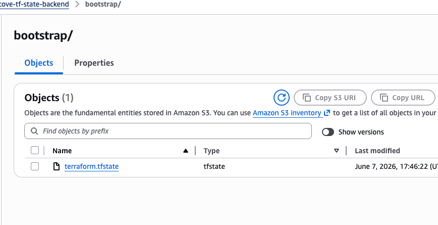
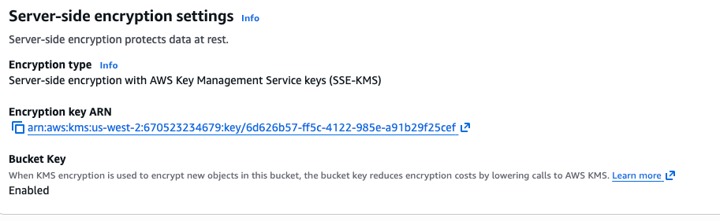
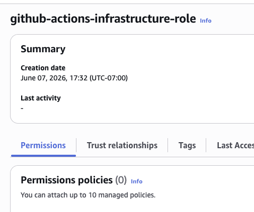
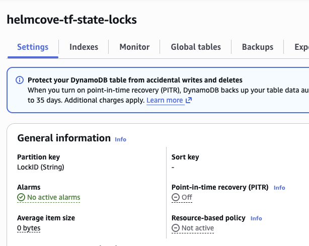

# Secure AWS GitOps CI/CD Pipeline 

### The Cloud Architecture
The project is to achieve a centralized state management utilizing AWS over local machines, providing strong encryption, collaboration, and security through IAM, KSM, and no local keys. 

AWS Initial Infrastructure Setup

## Terraform AWS Implementation Deep Dive 

### 🔑 AWS KMS
- Deploys an isolated KMS key resource giving access to data.
- Provides server side encryption across S3 backend, utilizing a 30 day key rotation, and provides better security then the regular AES256 encryption at rest. Beneifts like key rotation, aduiting, and access controls. 

### 🪣 AWS S3 Bucket 
- Created a helmcove-tf-state-backend bucket specifically for terraform.tf state files
- Enable version control for backups and resolving any potential corruption errors 
- S3 bucket ACL preventing public access
- Bucket-Key to cache KMS data keys saving costs

### 🆔 AWS IAM
- OIDC identity, not more AWS Acess Keys or Secret Keys inside code
- Restricts only to my repo `repo:Rookid21/aws-infra-bootstrap:*`

### GitOps Pipeline

- tfstate file in S3 Bucket

- Secure through KMS

- IAM role

- DynamoDB to avoid overlap corruption 
